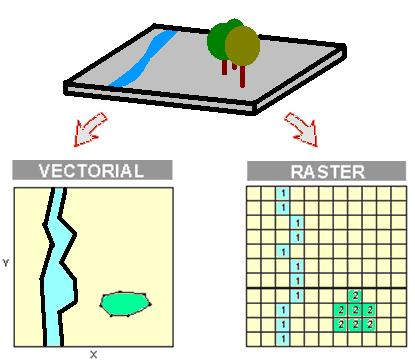
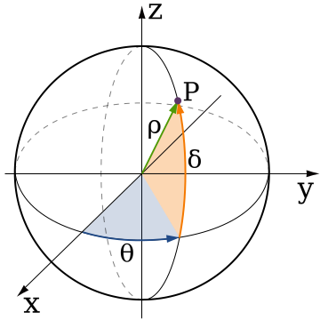

Dans de nombreuses situations, il peut être utile de représenter graphiquement des disparités géographique, par le biais d'une carte. Même si R n'est pas un outil cartographique dédié (comme peut l'être *ArcGIS* ou *QGIS*), de nombreux *packages* existent pour permettre de manipuler des données spatiales et pour fabriquer des cartes. 

L'utilisation de R peut s'avérer judicieuse quand il s'agit d'intoduire la production de carte dans un workflow d'analyse reposant déjà sur R. On évite ainsi de multiples importations/exportations des données avec leur lot de problèmes et erreurs, et on profite de la flexibilité du langage R et ses *packages*.

Ce document a pour but :

* d'**introduire les principales notions théoriques** en terme de cartographie 
* de **montrer en pratique comment réaliser une carte** à l'aide des principaux packages (dont `rgdal`, `sp`)

Les problématiques liées à l'analyse spatiale sous R ne seront pas traitées ici.

# Cartographie sous R : théorie

Pour réaliser une carte, on a généralement recours à plusieurs ingrédients :

* un **fond de carte** sur lequel nous allons ajouter nos propres données
* un **ensemble de données géolocalisées**, qui peuvent s'appliquer soit à un point, soit à une zone, qui devront être jointes à notre fond de carte 
* un **système de coordonnées cartographique et une projection ** qui déterminent la façon dont les données géographiques sont représentées


## Le fond de carte
Un fond de carte permet de représenter graphiquement les caractéristiques d'une région géographique d'intérêt. Le fond de carte permet de "planter le décor" et d'apporter les éléments contextuels utiles. C'est sur ce fond de carte que vont venir se greffer nos données géolocalisées.

Il existe une quantité infinie de fond de carte différent, qui peuvent grossièrement être rangés dans deux catégories :

<div style="text-align:center">


*A droite, une représentation matricielle de la zone. A gauche, une représentation vectorielle.*  
*Crédits : [Pau Fonseca i Casas](http://www-eio.upc.es/~pau), [CC BY-NC-ND 3.0](http://creativecommons.org/licenses/by-nc-nd/3.0/)*

 
</div>

* les **représentations vectorielles** (ou *vector layer*). Dans ce cas, les caractéristiques de la région d'intérêt sont représentées sous la forme d'un ensemble de formes (ou *features*) comme des points ou des tracés (lignes, polygones...). Ce format est particulièrement adapté à la représentation de zones géographiques bien délimitées, telles que les limites administratives (pays, régions, départements, communes), les limites géologiques, l'emplacement de villes, etc...


* les **représentations matricielles** (ou *raster layer*). Dans ce cas, les caractéristiques de la région d'intérêt sont stockées sous la forme d'une image (ensemble de pixel rangés en lignes/colonnes, d'où le nom). A chaque pixel est associé une valeur, permettant de décrire les caractéristiques. Par exemple, l'altitude peut être représentée sous le forme de pixels allant du vert au rouge, les plans d'eau peuvent être représentés par des pixels de couleur bleu, etc...

Bien évidemment, il est possible de combiner plusieurs représentations pour créer un fond de carte plus complexe (ex : combiner un fond *raster* représentant la densité de médecins au Km² et des données vectorielles représentant les limites des communes de France).

**EN PRATIQUE : **

Pour obtenir des fonds de cartes reprenant les limites des régions / départements / communes de France (sous forme de *vector layer*), le plus simple est d'utiliser les données [GEOFLA](http://professionnel.ign.fr/geofla) mises à disposition par l'IGN. Ces données sont distribuées sont au format ESRI Shapefile (SHP), standard très largement répandu et quasi-universel. 
A noter que le système cartographique utilisé dans ces fichiers est le **Lambert-93**, le format légal en France.

Dans certains cas, ces tracés peuvent ne pas être suffisants. D'autres versions, avec des niveaux de détail plus grossier ou plus fin sont distribuées sur internet, en particulier via la fondation [OpenStreetMap](https://openstreetmap.fr/), ou OSM pour les intimes. La plupart des jeux de données OSM directement réutilisables (fond de carte et cie) sont publiées sur le site de l'[Open Data](http://www.data.gouv.fr). A titre d'exemple, les données de tracé administratifs issus d'OSM sont disponibles [ici](https://www.data.gouv.fr/fr/dataset/limites-administratives-francaises-issues-d-openstreetmap). Attention, les données issues d'OSM sont diffusées dans le système **WGS84**.


## Données géolocalisées
De nos jours, les données géolocalisées ne sont pas ce qui manque. Les données géolocalisées peuvent être rattachées à une zone particulière (ex : à une région ou un département français), ou bien être rattachées à un point (ex : coordonnées GPS votre domicile).

En fonction du type de données (zone/point), l'exploitation qui peut en être faite va varier. Avec des données de zone, il est possible de créer des cartes à bases d'aplat de couleurs, ou [carte choroplèthe](http://fr.wikipedia.org/wiki/Carte_choropl%C3%A8the). Avec des données de points, on utilisera plutôt des représentations ponctuelles (ex : un point de taille variable, en fonction de la valeur) ou des représentation de densité/intensité (carte de chaleur, ou [heatmap](http://en.wikipedia.org/wiki/Heatmap)).

Pour les données de zone, on a généralement des données au format suivant : 

- une **colonne pour l'identifiant** de la zone concernée
- une ou plusieurs colonnes contenant les **valeurs des variables d'intérêt** (ex : population/m², nombre d'hospitalisations...)

L'enjeux sera alors généralement de fusionner sous R ces informations de zones à un objet décrivant ces zones (lui-même issu d'un fichier SHP le plus souvent). Par exemple, rattacher les informations sur le nombre d'hospitalisation par départements à un object spatial contenant les contours des départements...
A noter que dans ce cas là, les problèmes de coordonnées/projection ne se posent qu'à la création de l'objet spatial, pas à l'import des données. 

Pour les données ponctuelles, on a généralement les données au format suivant :

- une colonne longitude
- une colonne latitude
- une ou plusieurs colonnes contenant les valeurs des variables d'intérêt

Dans cette situation, il est impératif de **connaître le système de coordonnées** utilisé pour le calcul des coordonnées géographiques, sans quoi la représentation sera fausse. Le plus souvent, c'est le système WGS84 qui sera utilisé (si on parle de GPS quelque part ou que ce n'est pas précisé, c'est le WGS84...).
Si on souhaite fusionner ces données à un objet spatial (raster ou vectoriel), il faudra s'assurer que les systèmes de coordonnées et la projection est la même.

L'enjeux sera ici de créér un objet spatial à partir des coordonnées longitude/latitude, puis d'ajouter/fusionner les données d'intérêt. 

## Système de coordonnées et projection cartographique
Imaginons qu'on souhaite expliquer à quelqu'un où se situe précisement Paris sur la Terre. Il y a une quantité infinie de façon de le faire, en fonction du référentiel utilisé. Prenons par exemple comme point d'origine Rio de Janeiro, au Brésil. Dans ce cas là, on peut situer Paris en précisant que la ville est à X km vers l'Est, et à Y km vers le Nord. A partir du **point d'origine** (Rio de Janeiro) et des **coordonnées (X,Y)**, vous avez la position de Paris. Cette position sous-entend que la position de Rio de Janeiro est déjà connue, et qu'il est admis que les coordonnées sont données en Est puis Nord, en kilomètres.

Mais, si cela peut sembler suffisant de première abord, il existe un grand nombre de paramètres qui ne sont pas pris en compte ici : la **dérive des continents** (la distance Rio/Paris change constamment), la **déformation de la Terre**  (qui n'est pas une sphère parfaite), l'**altitude**...

En pratique, pour positionner des éléments sur le globe, on a recours au **coordonnées à base de latitude/longitude**. 

<div style="text-align:center">


*Coordonnées sphériques : latitude δ, longitude θ, and rayon ρ.*  
*Crédits : Wikimedia Commons*

 
</div>

Ces coordonnées vont dépendre de plusieurs éléments, les principaux étant : 

* **l'ellipsoïde de référence**, c'est-à-dire la forme de la sphère qui va représenter la Terre. Comme dit juste au dessus, la terre n'est pas une sphère parfaite : elle présente des irrégularités plus ou moins importantes selon les endroits (en gros, c'est une patatoïde !). Pour les calculs, on utilise des approximations, des **formes simplifiées qui s'approche de la forme de la Terre** : des ellipsoïdes de révolution.  
En fonction des utilisations et de la représentation voulue, le choix de l'ellipsoïde doit être adapté. Par exemple, pour une  représentation globale de la Terre, on choisira l'ellipsoïde globalement le plus proche de la forme générale de la Terre. A l'inverse, pour une représentation d'une zone particulière (ex : la France) on peut utiliser un ellipsoïde plus proche de la forme de la Terre à cet zone, pour des raisons de précisions.  
Parmi les ellipsoïdes fréquemment utilisés, on peut citer le **WGS84** (celui utilisé dans le système du même nom) ou l'**IAG-GRS80** (celui utilisé dans le système Lambert-93). A noter que, malgré quelques différences subtiles, ces deux ellipsoïdes sont quasi-identiques.

* **un point d'origine**. Selon les cas, l'origine sera déterminée soit par la position du centre de l'ellipsoïde, soit par un point de référence à la surface de la terre. 

On regroupe l'ensemble de ces éléments sous le terme de **système de coordonnées géographique** (*coordinate reference system* ou *CRS* pour nos amis anglais) ou de *datum*. Il en existe une très grande quantité.

Pour faire de la cartographie, un paramètre supplémentaire est nécessaire. En effet, une carte est une **représentation plane** du globe terrestre, il faut donc appliquer une **projection** aux coordonnées pour pouvoir les afficher dans un plan. Là aussi, de multiples possibilités s'offre à nous : projection cylindrique, projection conique... avec des propriétés distinctes. Le choix de la projection va fortement influencer le rendu sur la carte (ex : taille et forme des pays).

L'ensemble **datum + projection** est désigné par le terme **système de référence spatiale** (*spatial reference system* ou *SRS*). Ils sont référencés sous la forme d'un **code EPSG à 4 chiffres**, pour simplifier leur utilisation.   

**EN PRATIQUE : **

Des coordonnées en latitude/longitude ne veulent rien dire si le datum utilisé n'est pas donné. Pour une carte, cette information est nécessairement couplée au type de projection utilisée. Les principaux codes EPSG à connaître sont le **EPSG:4326** (basé sur le système WGS84, très usité puisque le GPS se base dessus) et le **EPSG:2154** (basé sur le système Lambert-93).  
Pour trouver un code EPSG, on pourra se référer aux sites internet [spatialrefrence.org](http://spatialreference.org/) ou [epsg.io](http://epsg.io/).

# Cartographie sous R : pratique

Nous allons utiliser les packages `sp` et `rgdal` pour importer un fond de carte au format SHP reprenant le tracé des communes de France. Nous travaillerons ensuite sur l'Ile-de-France : des données extérieures sur le temps de parcours pour hospitalisation seront jointes à notre object spatial, et une carte basée sur ces données sera produite.  
Les packages `RColorBrewer` et `classInt` seront utilisés pour sélectionner des groupes de couleurs adaptées, et pour catégoriser simplement des variables, respectivement.  
Le rendu des carte se fera par l'intermédiaire du package `base`, partie intégrante de la distribution standard de R. D'autres packages, comme `ggplot2` , `rCarto` , `maptools` ou `ggmap` (un dérivé de `ggplot2`) peuvent être utilisés. Des exemples utilisant ces packages seront ajoutés à l'avenir. 

Première chose à faire : installer et charger les packages nécessaires
```{r eval=FALSE}
# Installation des packages de base
install.packages("sp")
install.packages("rgdal")

# Installation des packages accessoires
install.packages("RColorBrewer")
install.packages("classInt")

# Installation des packages de rendu
install.packages("ggplot2")
install.packages("ggmap")
install.packages("maptools")
```

```{r  warning=FALSE, message=FALSE}
# Import des librairies nécessaires
library("sp")
library("rgdal")

library("RColorBrewer")
library("classInt")

library("ggplot2")
library("ggmap")
library("maptools")
```

On récupère sur le site de l'IGN la carte et ses données associées (fichier .PROJ contenant les informations de projection et fichier .DBF contenant les informations géolocalisées fournies par l'IGN). L'ensemble des données utilisées est disponible [ici](http://professionnel.ign.fr/geofla) dans l'onglet *Téléchargements*. Nous utiliserons pour cette exemple les données 2013 des communes de France métropolitaine.

Le fichier 7z (format 7zip, lisible par le logiciel du même nom) contient un ensemble de dossiers/sous-dossiers. Les informations qui nous intéressent sont dans un sous-dossier du type **DONNEES_LIVRAISON**. Décompressez l'ensemble des fichiers de ce sous-dossier. Nous allons enfin pouvoir passer à la fabrication de la carte dans R. De manière général, il est recommandé de vérifier que les données qu'on va manipuler sont correctement reconnues dans R. Ceci s'applique à toutes les situations, et la cartographie ne fait pas exception. 

## Chargement des données spatiales

Il existe plusieurs façons de charger des données spatiales dans R, faisant intervenir différents packages. Ici, nous utilserons uniquement les fonctions de chargement issus du packages `rgdal`. Ce package est une interface entre R et la "Geospatial Abstraction Library" (GDAL), une bibliothèque de fonctions dédiées aux manipulations de données spatiales très largement utilisée.

La fonction `ogrInfo` permet de scanner les données que l'on veut manipuler, de façon à vérifier qu'elles seront bien lues et reconnues par la suite. Cette fonction `ogrInfo` (tout comme `readOGR`, qu'on va voir plus loin) prend 2 arguments indispensables :

* **le chemin pointant vers le fichier SHP et ses données associées**. Si vos données sont dans le répertoire courant de travail sous R, il est quand même nécessaire de remplir cet argument, avec "." (le point . désignant sous R le répertoire de travail courant)
* **le nom du layer**, c'est-à-dire le nom du fichier .SHP (sans mettre l'extension au bout). Il est communément admis que l'ensemble des fichiers relatifs au fichier SHP portent le même nom, seule l'extension change. Ex : COMMUNE.SHP est accompagné de COMMUNE.PROJ, de COMMUNE.DBF, etc. Ainsi, avec une commande, R va charger le SHP, reconnaitre la projection et charger les données associées...

On commence par déterminer l'emplacement de notre fichier SHP, et on scan son contenu :
```{r}
# Emplacement de l'archive décompressée, à remplacer par le votre
pathToShp <- "./data/shp"
# Description des données via orgInfo
# Attention à ne pas mettre l'extension à la fin du nom
ogrInfo(dsn = pathToShp,layer="COMMUNE")
```

Ici, on voit que les données sont correctement reconnues (driver adapté au format ESRI Shapefile, le SRS est reconnu, les données associées sont bien présentes). A noter que **pour accéder directement aux données de coordonnées/projection** (pour vérifier ou modifier ces informations), il est plus simple d'utiliser directement la fonction `proj4string()`.

Les données étant OK, on peut importer le fichier SHP et ses données associées via la fonction `readOGR()`, afin de créer un objet nommé ici `comm`. On regarde ensuite la structure de l'objet crée par `rgdal` ;
```{r}
# Import via la fonction readOGR de rgdal
# Pour info, d'autres outils existent (ex : fonction readShapeSpatial() du package maptools)
comm <- readOGR(dsn = pathToShp, layer="COMMUNE", stringsAsFactors=FALSE)

# Description de la structure globale
str(comm, 2)
```

Les objets créés via `readOGR` ont des structures particulières. Ils sont divisés en plusieurs sous-objets, ou **slots**, préfixé par le symbole `@`. Chaque sous-objet possède sa propre structure, et ses propres informations. Pour y accéder, la commande suit le même motif que pour accéder à une variable dans un dataframe, mais via le symbole `@` au lieu du symbole `$`.

Les informations de géométries, relatives au fichier .SHP, sont stockées dans les slots `@polygons`, `@plotOrder` et `@bbox`. Les données associées, issues du fichier .DBF, sont dans le slot `@data`. Enfin, les données de projection, issues du fichier .PROJ, sont dans un slot à part, `@proj4string`. Pour plus d'informations, vous pouvez regarder la documentation accompagnant cette classe particulière avec la commande `class?SpatialPolygons `. 

Jetons par curiosité un oeil au slot `@data` :
```{r}
# Description de la structure des données associées 
str(comm@data, 2)
```

On voit ici le nom des variables importées, et leur format (numérique, charactère...).

De même pour le slot `@polygons` :
```{r}
# Description de la structure des données vectorielles 
head(comm@polygons, n=1)
```

Nos données associées, comme le code INSEE de la commune, son nom, son statut administratif, sa superficie, sa population, etc... sont correctement importées dans notre slot `@data`. 

On peut dès à présent fabriquer une carte très simple représentant les contours des communes, à partir des données spatiales extriates. A titre d'exemple, on va utiliser ici la nouvelle méthode de `plot`, spécifique à la classe `SpatialPolygons` et ajouté par le package `sp`. Concrètement, cet ajout permet d'utiliser la fonction classique `plot` pour représenter graphiquement des objets spatiaux.
```{r}
# On représente les contours des communes de France avec la fonction plot
plot(comm)
```

Il y vraiment beaucoup de communes en France ! Du coup, une telle carte est difficilement lisible et particulièrement longue à créer... Et si on se limitait à l'Ile-de-France pour nos tests ? 

Pour représenter uniquement les communes d'Ile-de-France (astuce : c'est la région numéro 11), il suffit d'appliquer une sélection "classique" à l'objet `comm` grâce aux variables à notre disposition, comme on pourrait le faire avec un dataframe :
```{r}
# On plot les communes contenues dans l'Ile-de-France (CODE_REG égal à 11)
plot(comm[comm$CODE_REG=="11",],)
```

On obtient donc bien la carte des contours des communes d'Ile-de-France. 

Supposons maintenant qu'on veut faire ressortir de cette carte les communes dont la population est de moins de 10 000 habitants. On peut chaîner les critères de sélections, comme on le fait habituellement via `&` ou `|` :
```{r}
# Communes d'IDF avec moins de 10 000 habitants
plot(comm[comm$CODE_REG=="11" & comm$POPULATION<1,],)
```

Notre carte ressemble à du gruyère ! C'est normal, puisque R n'a représenté que les communes remplissant nos critères. Les autres communes n'ont donc pas été traitées et sont absentes de la carte... 

Si on souhaite juste faire ressortir les communes d'intérêt, on peut commencer par représenter toutes les communes d'Ile-de-France, puis représenter en rouge les communes de moins de 10 000 habitants uniquement. Par exemple :
```{r}
# Représentation de toutes les communes d'IDF
plot(comm[comm$CODE_REG=="11",])
# Ajout sur le graphique précédent (via add = TRUE) des communes d'intérêt, remplies en rouge (via col="red") 
plot(comm[comm$CODE_REG=="11" & comm$POPULATION<1,], col="red", add=TRUE)
```

C'est déjà mieux ! 

## Utiliser des données externes dans notre carte

Nous avons vu comment créer une carte très simple à partir de données spatiales (issues du .SHP) et des données associées (issues du .DBF). Les données associées sont généralement très limitées, et ne contiennent pas le plus souvent les informations qui nous intéresse réellement. Il est donc nécessaire de marier nos données spatiales avec des données externes.

Pour cet exemple, j'ai choisi un jeu de données décrivant la **distance parcourue par un patient pour se rendre sur son lieu d'hospitalisation**. Cette distance est calculée ici en terme **temps moyen de trajet (en minutes)** pour accéder en voiture au lieu d'hospitalisation.
Le jeu de donnée original est disponible en accès libre sur le site de l'[OpenData](http://www.data.gouv.fr/fr/dataset/a-quelle-distance-de-chez-soi-se-fait-on-hospitaliser-30378436). Comme d'habitude, le fichier est au format XLS et comporte des mentions (titre, précision, etc...) rendant son utilisation directe impossible.
Pour gagner du temps, vous trouverez [ici](distance_hospit_Etalab.csv) une version utilisable de la table de données.

Commençons par importer nos données : 
```{r}
# Emplacement des données
pathToData <- "./data/distance_hospit_Etalab.csv"
# Import des données en respectant le format "Character" des codes communes
tempsTrajet <- read.csv2(file = pathToData, stringsAsFactor = FALSE, colClasses = c("character", "integer")) 
# Verification import
str(tempsTrajet)
```

Nous avons donc d'un coté notre objet `comm` comprenant nos données spatiales et les données associées, et d'un autre côté notre objet `tempsTrajet` comprenant nos données externes. L'idée est de rajouter nos données externes aux données associées déjà présentes dans notre slot `@data`. De cette façon, on conserve les informations de base (le nom des communes, leur numéro de département, etc...) tout en ajoutant les informations pertinentes pour nos analyses (les temps de trajet).

Plusieurs façons de réaliser cet ajout sont possibles. De façon générale, il faut faire attention à ne pas bousculer l'ordre des données du slot `@data` car ces données sont jointes ligne-à-ligne avec les données spatiale. On peut utiliser la fonction `match()`,la classique fonction `merge()`, voir la fonction `left_join()` issue du package `dplyr` (les habitués du SQL seront en terrain familier).

Pour la beauté de l'exemple, la fonction `match()` est utilisée ici. On constitue un nouveau dataframe, composé d'une part des données originales, et d'autre part des données de temps de trajet, rangées dans le même ordre que les données originales, grâce à `match()`. Les variables clefs permettant d'identifier uniquement chaque commune n'étant pas les mêmes dans les deux jeux de données, elles sont précisées manuellement. 
```{r}
# On remplace le slot @data par un nouveau tableau de données, contenant les anciennes données + les nouvelles
comm@data <- data.frame(comm@data, tempsTrajet[match(comm@data[, "INSEE_COM"],tempsTrajet[, "commune"]), ])
head(comm@data)
```
On a bien fusionné nos infos, mais on remarque au passage que nous avons récupéré toutes les colonnes de `tempsTrajet`, y compris la variable `commune` qui fait doublon, mais passons.

En étant plus pragmatique, nous aurions pu faire un simple :
```{r, eval=F}
# Chargement de dplyr
library(dplyr)
# On remplace le slot @data par un nouveau tableau de données, contenant les anciennes données + les nouvelles
comm@data <- left_join(comm@data, tempsTrajet, by = c("INSEE_COM" = "commune"))
```

Imaginons maintenant qu'on souhaite produire la carte des temps de trajet, pour la région Ile-De-France. Nous allons réduire notre jeu de données pour ne garder que la région Ile-De-France. Nous allons aussi utiliser `classInt` pour discrétiser notre temps de trajet, et `RColorBrewer` pour choisir des couleurs adaptées à notre nouvelle variable discrète.
```{r}
# Filtrage des données pour ne garder que la région Ile-De-France
idf <- comm[comm@data$CODE_REG=="11",]
# Vérification
str(idf, 2)

# Découpage du temps de trajet en 5 classes via la méthodes des quantiles : idenfication des bornes (breaks, ou brks)
classTemps <- classIntervals(idf@data$temps, 5, style = "quantile")
# Choix d'une palette de couleur pour les 5 catégories
palette <- brewer.pal(n = 5, name = "YlOrRd")


# Application de ce découpage à variable temps, sauvegarde dans temps_cat
# On stocke, pour chaque observation, la valeur de la couleur correspondante
idf@data$temps_cat <- as.character(cut(idf@data$temps, breaks = classTemps$brks, labels = palette, include.lowest = TRUE))

# On stocke l'information des classes pour créer une légende 
legende <- as.character(levels(cut(idf@data$temps, breaks = classTemps$brks, include.lowest = TRUE, right = FALSE)))

# Vérification
str(idf@data)

```

Il ne reste plus qu'à faire notre carte :

```{r}
# Avec le package base
plot(idf, col = idf@data$temps_cat, border = "black")
legend("bottomleft", legend = legende, fill = palette, cex=0.6, title = "Temps de parcours moyen (minutes)")

````

#Annexe

##classInt
Si la fonction `cut()` (inclue par défaut dans R) permet de découper très facilement une variable continue en classes, elle nécessite une liste de valeurs seuils (ou *breaks*). La fonction `classIntervals()` du *package* `classInt` permet de calculer facilement ces valeurs seuils, en appliquant différentes méthodes. Par défaut, cette fonction retourne un objet contenant les valeurs seuils dans une variable nommée `brks`.

Pour plus d'information les différentes méthodes applicables pour le calcul des seuils, référez-vous à la documentation de ce *package*.

##RBrewerColor
Le choix d'une palette de couleur pour un graphique n'est pas forcément facile. En fonction de la palette choisie, il est possible de faire ressortir (ou pas) différentes informations. Par exemple, l'utilisation d'une palette Kallant du jaune au rouge implique l'idée de progression entre les catégories : ce mode de représentation ne sera pas vraiment adapté à la représentation d'une variable qualitative... Dernier détail d'importance, certaines couleurs s'associent naturellement et vont sembler harmonieuses, d'autres non, ce qui peut fortement influencer la perception d'un graphique. 
Le package `RBrewerColor` facilite cette tâche, en proposant différentes palettes adaptées au nombre de classes (donc de couleurs) voulues, et adaptée au mode de représentation désiré (données séquentielles, divergeantes ou qualitatives). Les palettes *séquentielles* vont être adaptée à des données ordonnées et traduisent l'idée de progression (ex : jaune = faible valeur, rouge = forte valeur). Les palettes *divergeantes* permettent de mettre en avant les valeurs extrêmes, et en retrait les valeurs centrales. Enfin, les palettes *qualitatives* sont utilisables pour des variables où les catégories n'ont pas lien de valeur entre elles (ex : blond ou roux). 

Pour avoir un aperçu des palettes disponibles, vous pouvez utiliser la fonction `display.brewer.all()`. Pour plus d'information (sur le nom des palettes, etc...), référez-vous à la documentation du *package*.